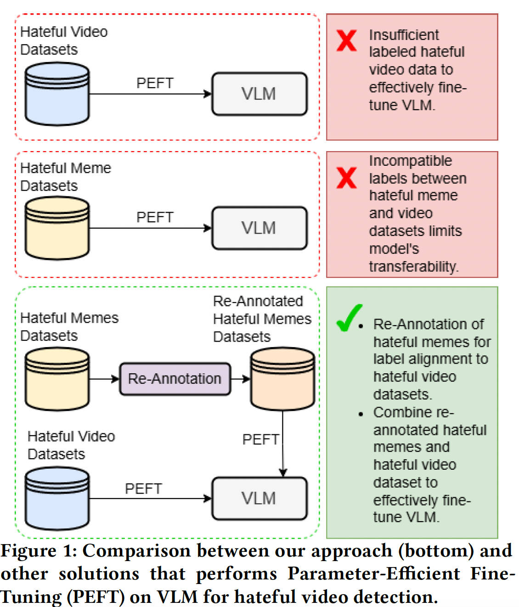
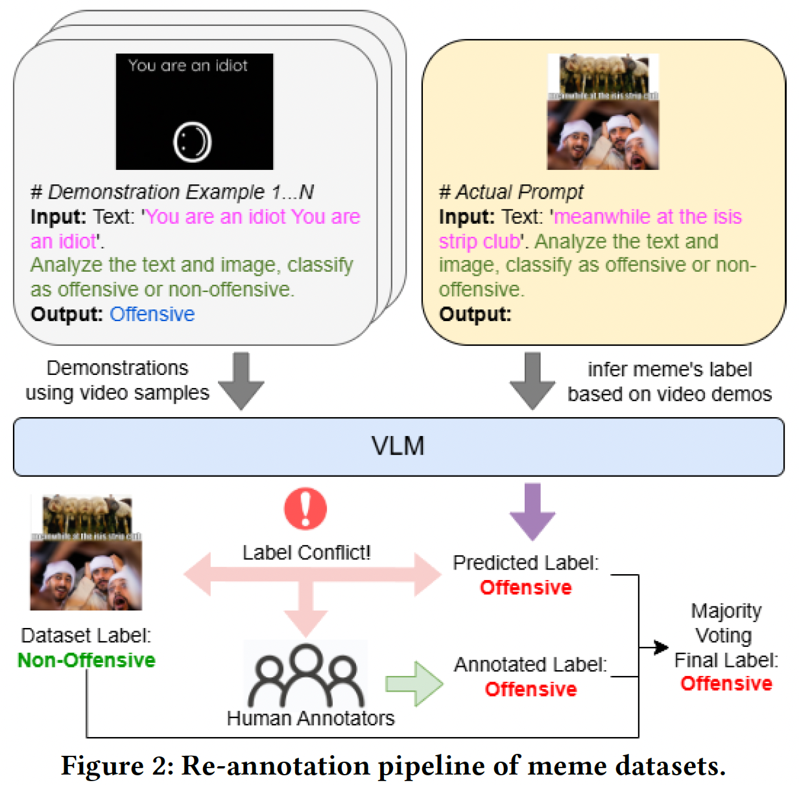
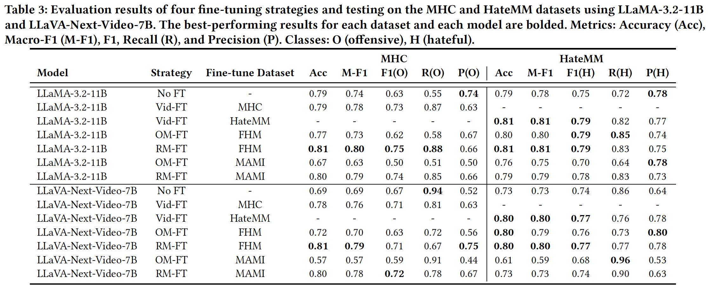
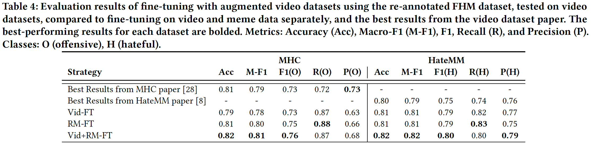

# CrossModalTransferLearning

Repository for the paper *"Cross-Modal Transfer from Memes to Videos: Addressing Data Scarcity in Hateful Video Detection"*.

## Fine-tuning Pipeline

This work explores using meme datasets to fine-tune models for hateful video detection, addressing data scarcity in video datasets. Initial experiments revealed performance gaps due to inconsistencies in label definitions. To mitigate this, we implemented a model-prediction-driven, human-assisted re-annotation pipeline, aligning meme labels with video dataset standards. The pipeline integrates meme dataset labels, model predictions via few-shot prompting, and human annotations through majority voting. Fine-tuning on re-annotated meme datasets achieved performance comparable to video-trained models, demonstrating their utility as substitutes. We utilized Facebook Hateful Memes (FHM) and MAMI datasets as sources and targeted MultiHateClip (MHC) and HateMM as video datasets, fine-tuning large vision-language models, LLaMA-3.2-11B and LLaVA-Next-Video-7B.



## Re-annotation Pipeline

The re-annotation process combines original meme labels, model predictions, and human annotations to align with video label definitions. Predictions were generated using state-of-the-art vision-language models (e.g., LLaMA-3.2-11B) with few-shot prompting, where memes were queried using structured prompts without labels for prediction. Final labels were determined via majority voting to ensure consistency with video datasets.



## Substitution Results

Fine-tuning on re-annotated memes (RM-FT) significantly outperformed both no fine-tuning (No-FT) and fine-tuning on original memes (OM-FT), achieving parity with video fine-tuning (Vid-FT).



## Augmentation Results

Combining video data with re-annotated memes for fine-tuning consistently outperformed standalone methods (Vid-FT, RM-FT) and prior benchmarks, highlighting memes as effective substitutes and augmentations for video datasets in data-scarce scenarios.



## Resources

- **Re-annotated Dataset**: Available in `dataset/re-annotated_meme`.
- **Scripts**: Fine-tuning and inference scripts using LoRA are provided in the `script` directory.

### Citation

If you find this dataset useful, please cite:

```bibtex
@inproceedings{M2VTransfer:conf/www/2025,
  author       = {Han Wang, Tan Rui Yang, Roy Ka-Wei Lee},
  title        = {Cross-Modal Transfer from Memes to Videos: Addressing Data Scarcity in Hateful Video Detection},
  booktitle    = {Proceedings of the ACM Web Conference 2025},
  publisher    = {{ACM}},
  year         = {2025}
}
```
